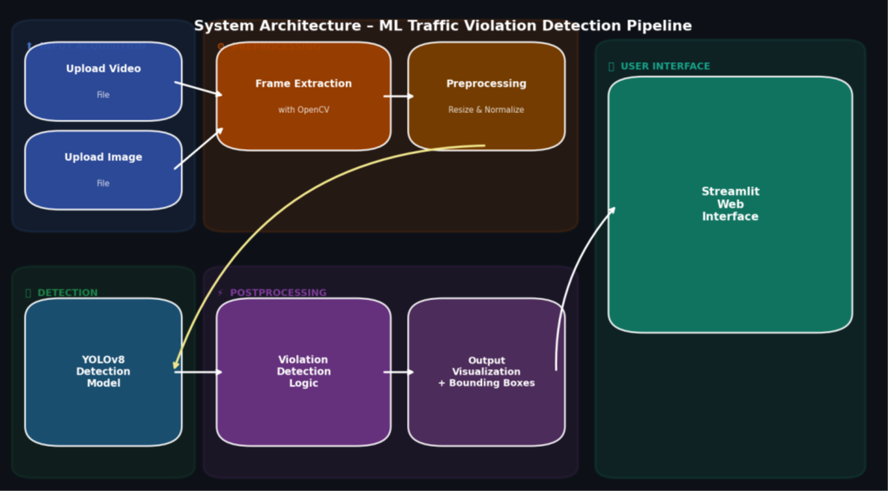
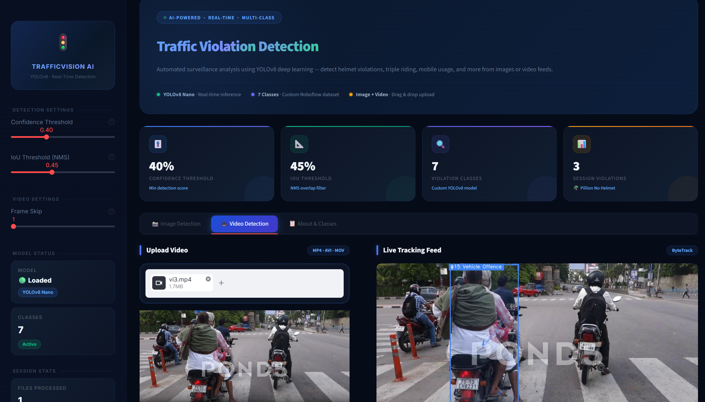
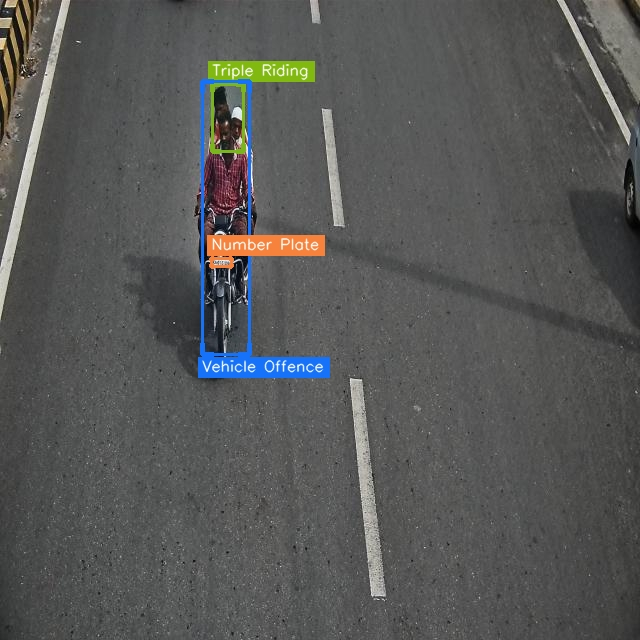
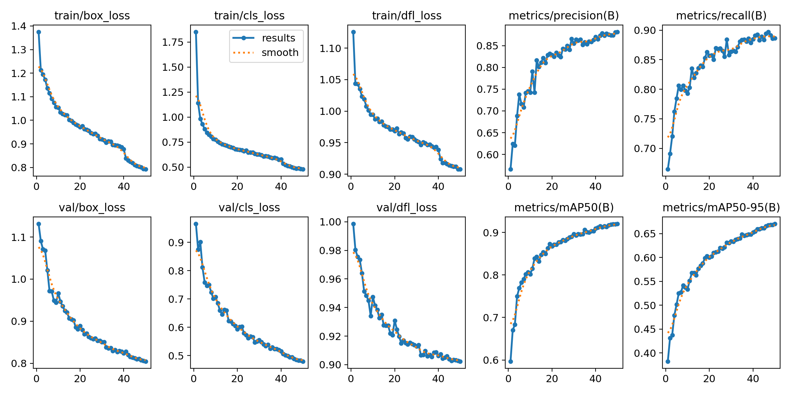
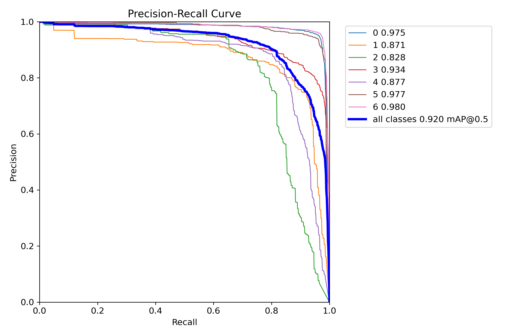
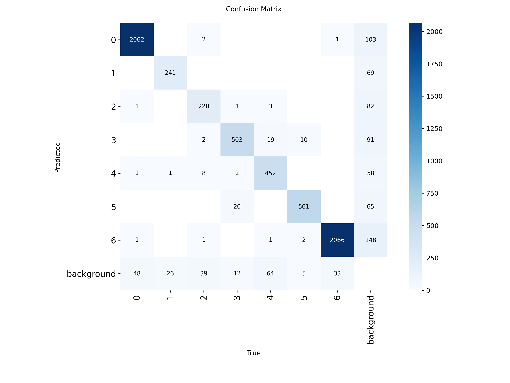
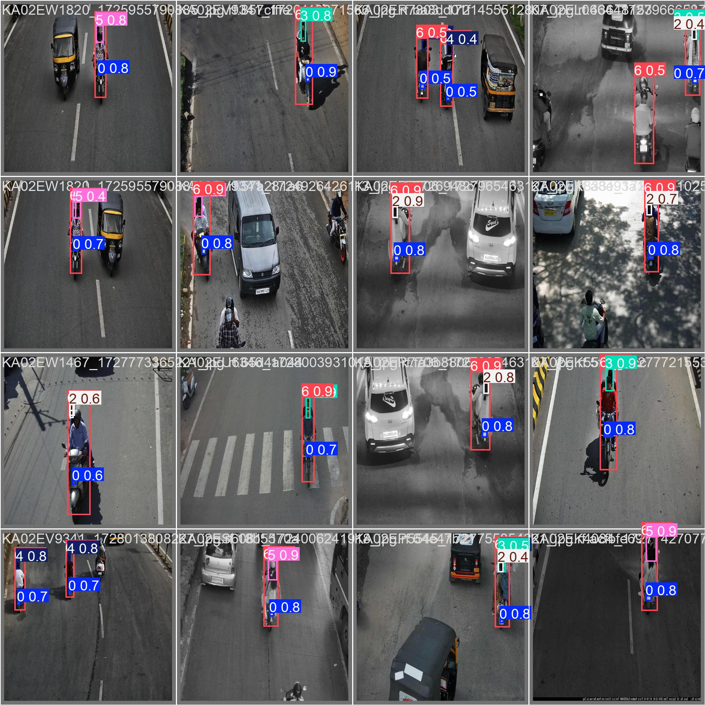
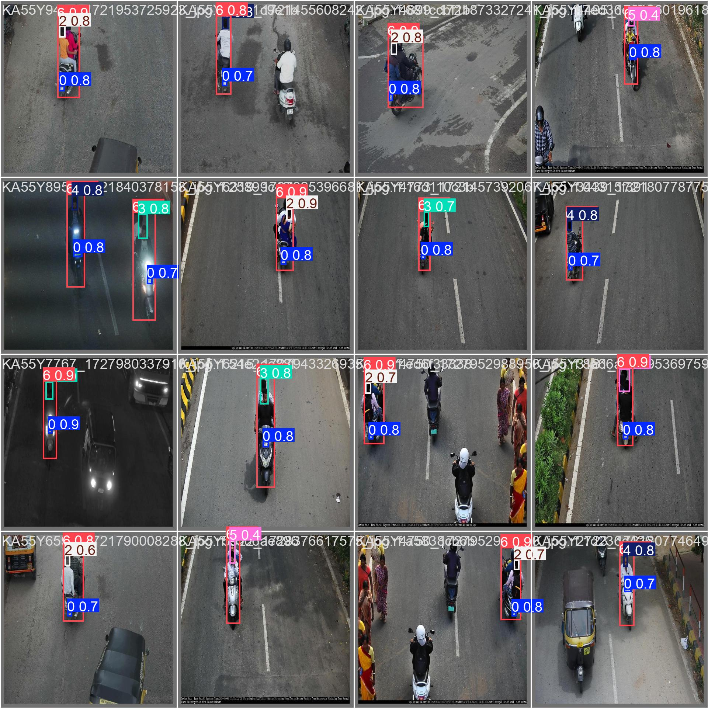
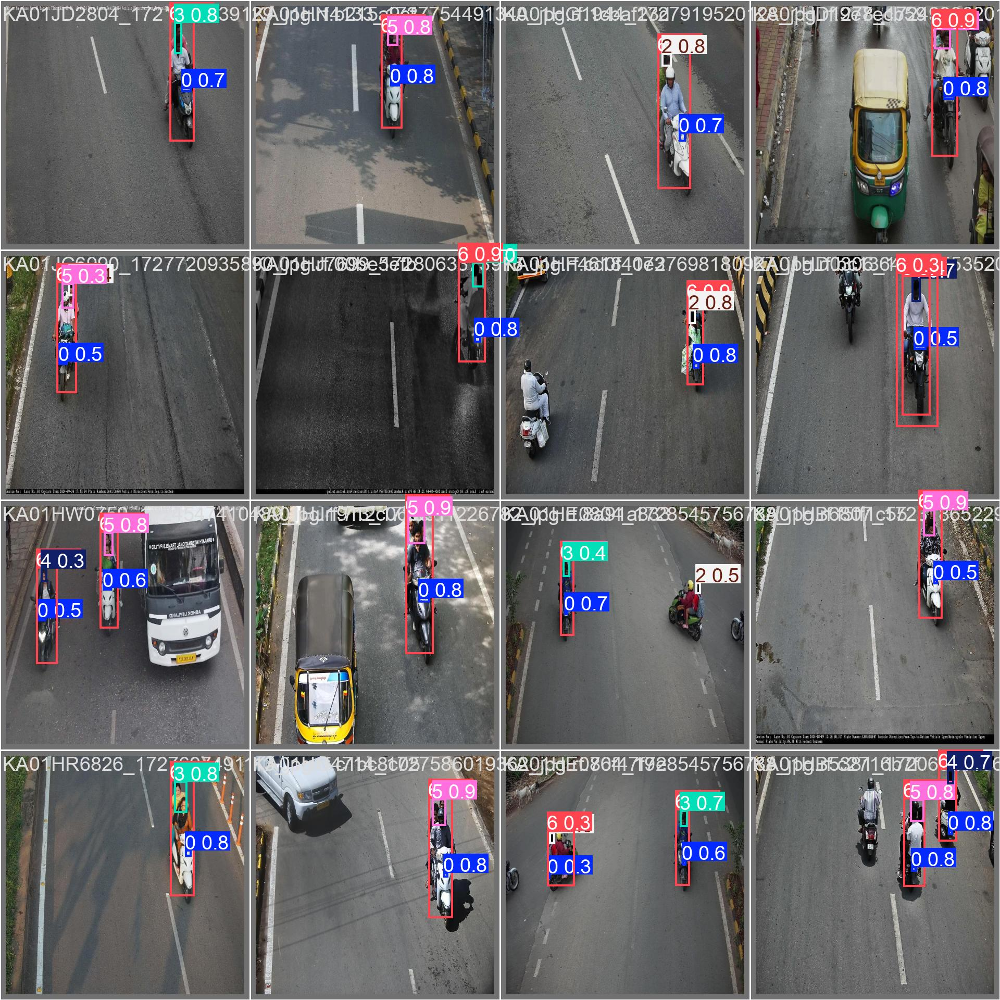

# 🚦 ML-Powered Traffic Violation Detection using YOLOv8


---

# 📌 Project Overview

Traffic rule violations are one of the leading causes of road accidents worldwide. Manual monitoring of surveillance footage is time-consuming and prone to human error.

This project presents an **AI-powered Traffic Violation Detection System** built using **YOLOv8** and **Streamlit** that automatically detects multiple traffic violations from images and videos captured by surveillance cameras.

The application provides fast and accurate real-time detection, making it suitable for intelligent traffic monitoring systems.

---

# ✨ Features

- 🚦 Real-time traffic violation detection
- 📷 Image upload support
- 🎥 Video upload support
- 📦 YOLOv8 Object Detection
- ⚡ Fast inference
- 🖥️ Interactive Streamlit interface
- 📊 Detection summary
- 🎯 Bounding boxes with violation labels

---

# 🚨 Supported Violations

| Icon | Violation |
|------|-----------|
| 🔢 | Number Plate Detection |
| 📱 | Mobile Usage While Riding |
| 🪖 | Pillion Rider Without Helmet |
| ⛑️ | Rider & Pillion Without Helmet |
| 🚫 | Rider Without Helmet |
| 👥 | Triple Riding |
| 🚗 | Vehicle With Offence |

---

# 🧠 Model Information

| Parameter | Value |
|-----------|-------|
| Model | YOLOv8n |
| Framework | Ultralytics YOLOv8 |
| Image Size | 640 × 640 |
| Epochs | 50 |
| Input | Image / Video |
| Output | Detected Violations with Bounding Boxes |

---

# 📊 Dataset

The project uses a **custom traffic violation dataset** created by combining and preprocessing multiple traffic surveillance datasets.

### Dataset Contents

- Traffic Images
- Bounding Box Annotations
- YOLO Format Labels
- 7 Traffic Violation Classes

> **Note:** The complete dataset (~680 MB) is not included in this repository due to GitHub size limitations.

Dataset details are available in:

```
data/
├── data.yaml
├── dataset_link.txt
└── README.md
```

---

# 🏗️ System Architecture



### Workflow

```
Image / Video
      │
      ▼
Preprocessing
      │
      ▼
YOLOv8 Detection
      │
      ▼
Traffic Violation Classification
      │
      ▼
Bounding Boxes
      │
      ▼
Streamlit Dashboard
```

---

# 📷 Application Preview

## Streamlit Application



---

# 🚗 Detection Example



---

# 📈 Training Results

## Training Metrics



---

## Precision-Recall Curve



---

## Confusion Matrix



---

# 🎯 Prediction Examples

### Prediction 1



---

### Prediction 2



---

### Prediction 3



---

# 📂 Project Structure

```text
Traffic-Violation-Detection/
│
├── app.py
├── README.md
├── requirements.txt
├── runtime.txt
├── .gitignore
│
├── data/
│   ├── data.yaml
│   ├── dataset_link.txt
│   └── README.md
│
├── docs/
│   ├── Project_Report.pdf
│   └── Presentation.pptx
│
├── images/
│   ├── app.png
│   ├── architecture.png
│   ├── confusion_matrix.png
│   ├── detection_output.jpg
│   ├── prediction1.jpg
│   ├── prediction2.jpg
│   ├── prediction3.jpg
│   ├── pr_curve.png
│   └── results.png
│
├── models/
│   └── best.pt
│
├── notebooks/
│   └── ML_powered_Traffic.ipynb
│
└── src/
    └── Violation.py
```

---

# 🛠️ Technologies Used

- Python
- YOLOv8
- Ultralytics
- OpenCV
- Streamlit
- NumPy
- Pandas
- Pillow

---

# 🚀 Installation

Clone the repository

```bash
git clone https://github.com/Akarsh5830/Traffic-Violation-Detection.git
```

Go to the project folder

```bash
cd Traffic-Violation-Detection
```

Install dependencies

```bash
pip install -r requirements.txt
```

Run the application

```bash
streamlit run app.py
```

---

# 📊 Results

The trained YOLOv8 model successfully detects multiple traffic violations with high accuracy on surveillance images and videos.

The application can:

- Detect multiple violations simultaneously
- Process images and videos
- Display bounding boxes with violation labels
- Provide an interactive web interface

---

# 🔮 Future Improvements

- 🚦 Traffic Signal Violation Detection
- 🚗 Wrong Lane Detection
- 🚙 Speed Violation Detection
- 🔍 Number Plate OCR Integration
- ☁️ Cloud Deployment
- 📹 Live CCTV Camera Support
- 📱 Mobile Application

---

# 📚 References

- Ultralytics YOLOv8
- OpenCV Documentation
- Streamlit Documentation
- Roboflow Universe

---

# 👨‍💻 Author

**Akarsh Yadav**

B.Tech Computer Science (Artificial Intelligence)

Machine Learning | Computer Vision | Deep Learning

GitHub: https://github.com/Akarsh5830

---

## ⭐ If you found this project useful, consider giving it a star!